저장소: https://github.com/SAVX123/2026oss

## 팀원
 * 김현성(202327066) - 팀장
	> main브랜치 수정, README.md 작성
 * 박찬솔(202327061)
	> dev/a 브랜치 수정
 * 김재훈(201907051)
	> dev/b 브랜치 수정
 * 이현상(202507049)
	> dev/c 브랜치 수정
---
### 과정
1. main 브랜치에서 dev/a, dev/b, dev/c 브랜치 차례로 병합
1. 브랜치 병합 도중 에러 발생
1. 발생한 에러 수정 후 fast-forward 병합 완료
1. git에 업로드 후 실행 결과 캡처
1. readme.md 작성
---
### 중간과정 스크린샷
1. 팀원들이 각자 브랜치에서 코드 수정
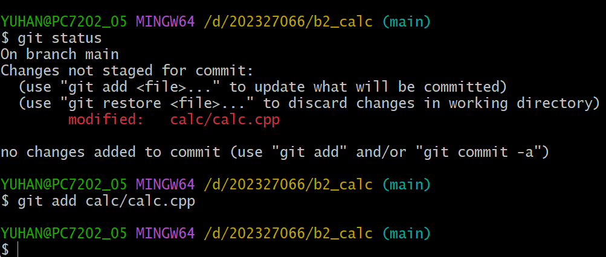
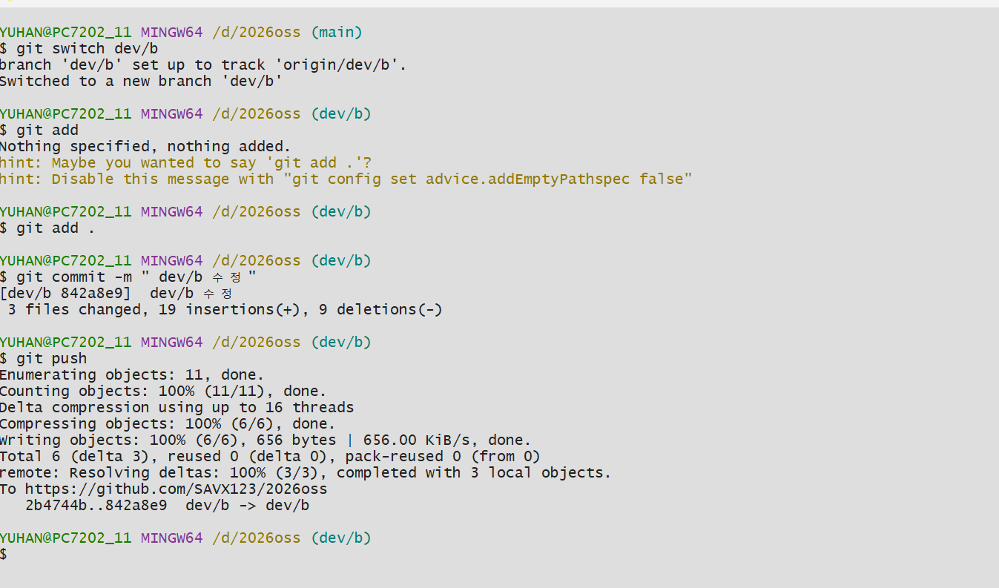
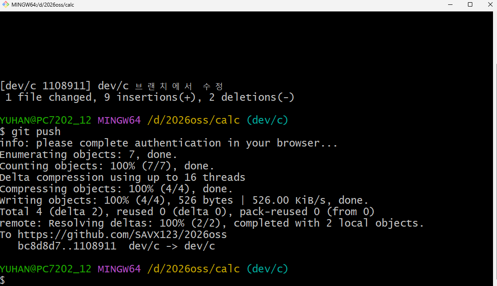
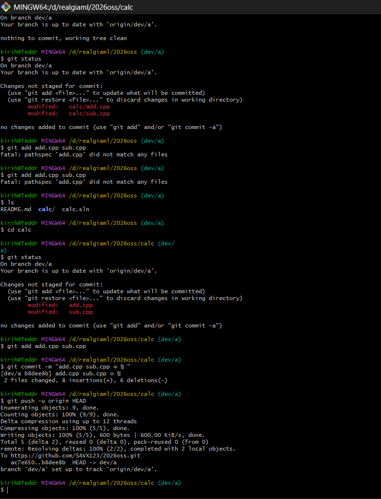
1. 코드가 수정된 브랜치 원격 저장소를 통해 가져오기
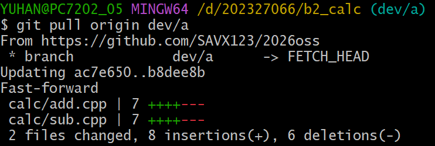
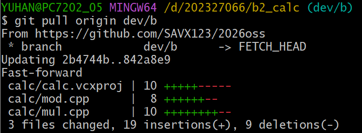
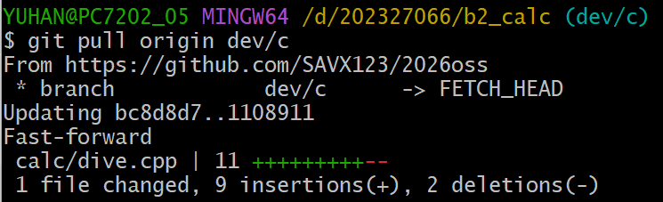
1. 브랜치 병합 도중 에러 발생
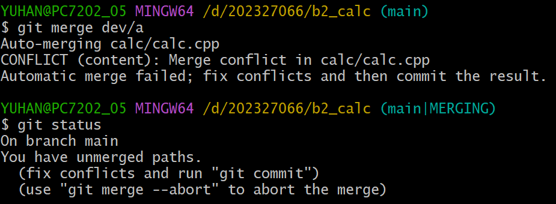
1. 에러 해결 후 병합완료
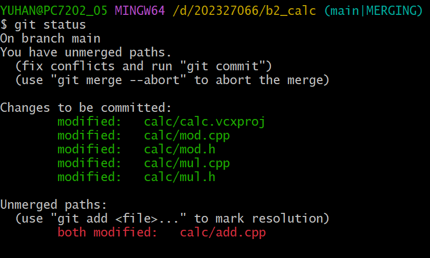
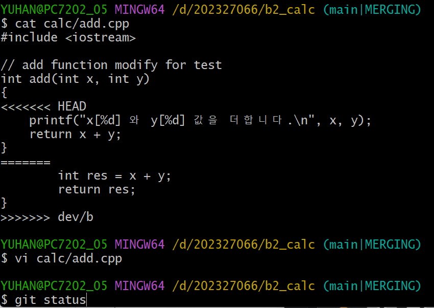
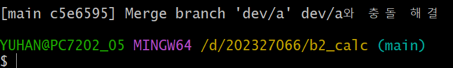
1. gitflow 화면
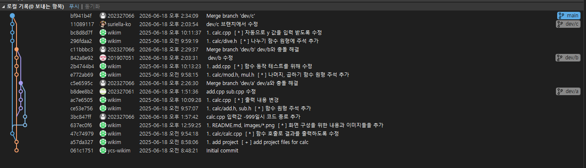
1. 프로그램 결과 화면
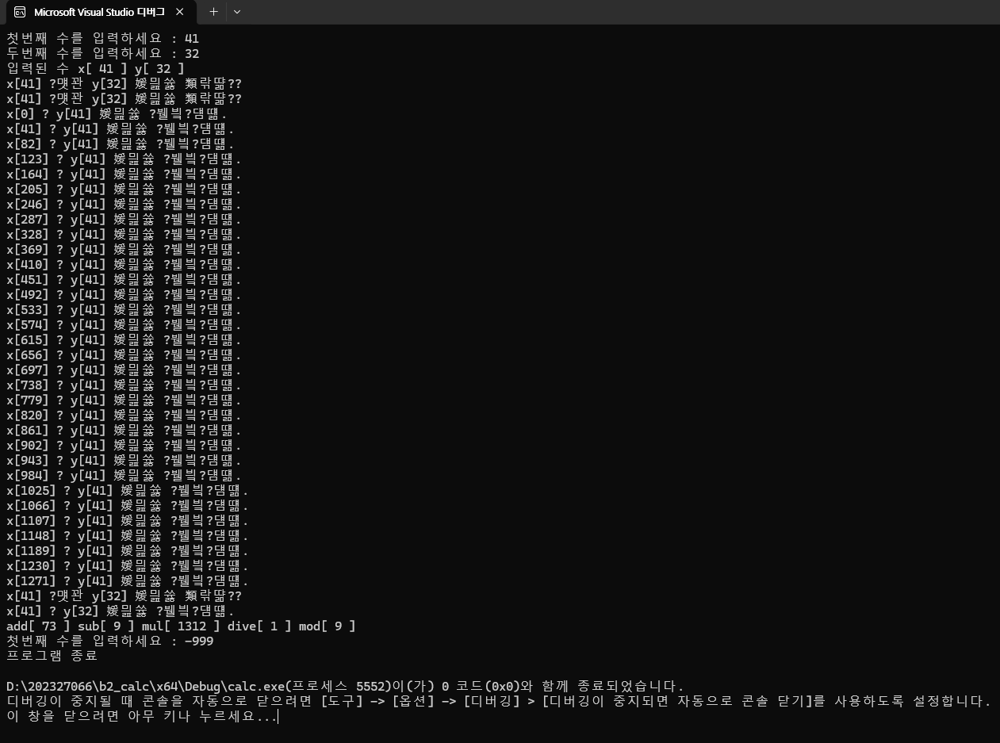
